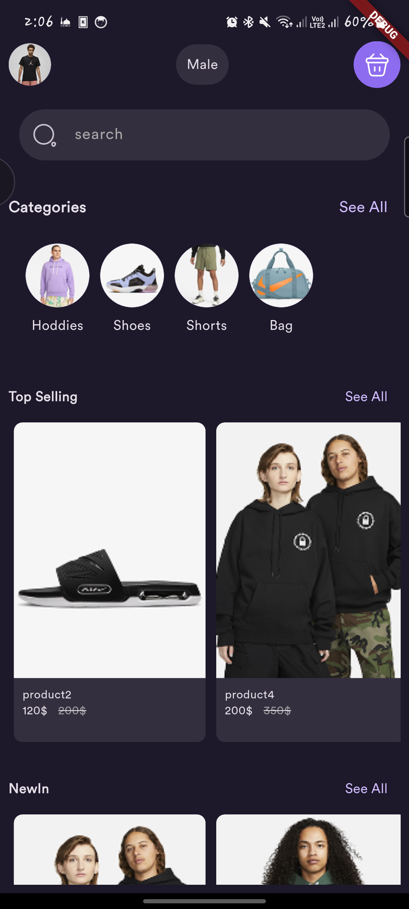
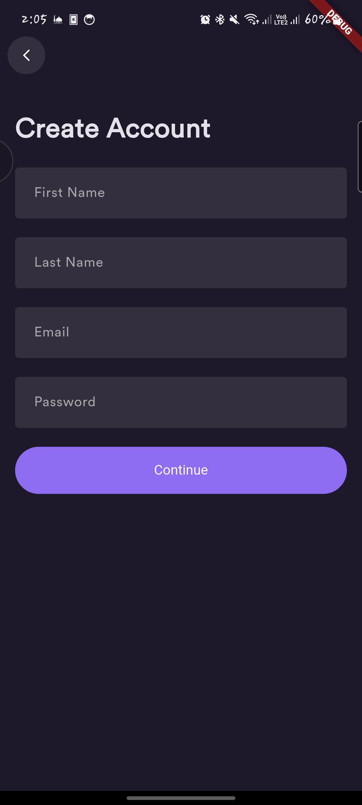
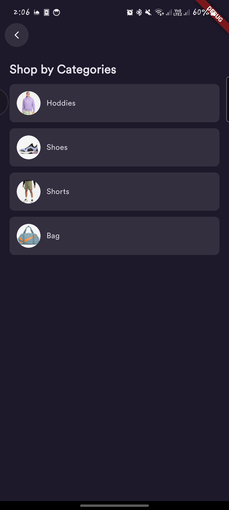
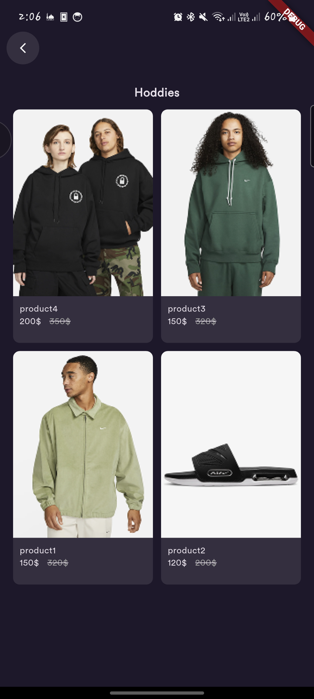
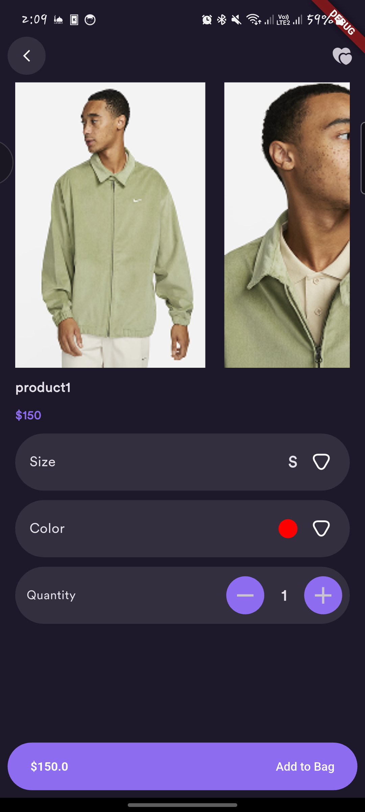
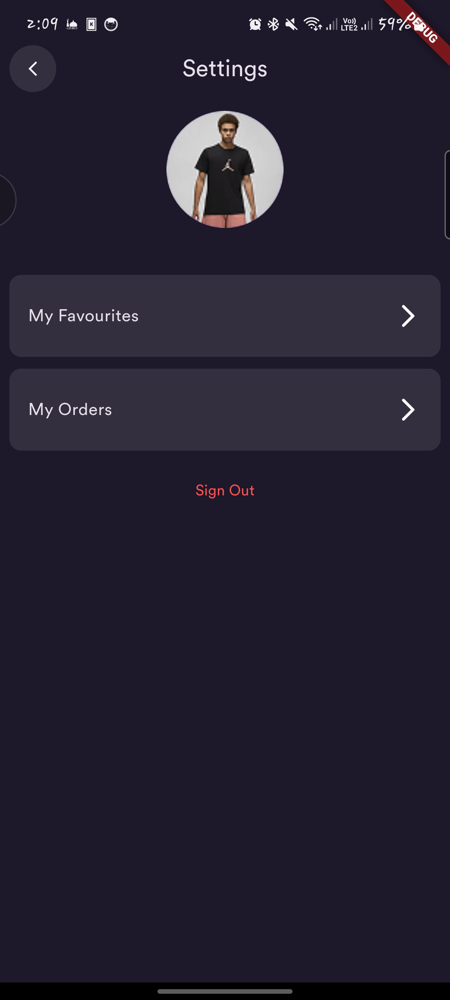
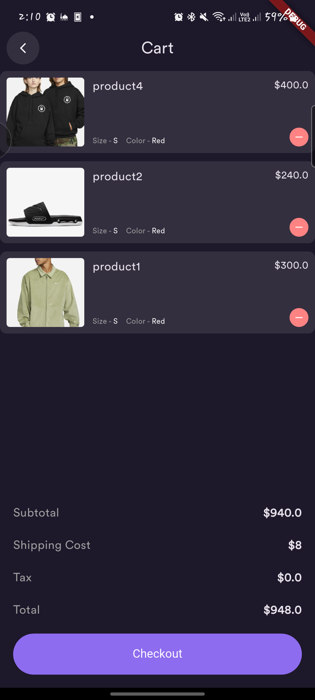

# 🛍️ E-Commerce Flutter App

A modern **E-Commerce** mobile application built with **Flutter**, following **Clean Architecture principles** and using **BLoC** for state management.  
This project demonstrates scalable architecture, testability, and maintainable code for production-grade apps.

---

## 📷 Screenshots

| Home | Login | SignUp |
|------|-------|--------|
|  |  |  |

| Categories | Products | Products Details |
|------------|----------|------------------|
|  |  |  |

| Settings | Cart |
|----------|------|
|  |  |

---

## 🚀 Features

### 🔐 Authentication
- User **Sign Up**, **Login**, and **Logout**
- **Form validation** and input handling
- Persistent login (FirebaseAuth or SharedPreferences)

### 🧩 Categories
- Fetch and display product categories dynamically
- Filter products by category
- Reusable UI components for clean presentation

### 🛒 Products
- Product listing with name, price, and image
- **Product Details Page** with extended info
- Add to cart (extendable feature)

---

## 🧠 State Management — BLoC

The app uses **BLoC (Business Logic Component)** to separate UI from logic, ensuring predictable and testable states.  
